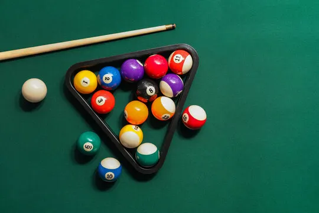

# 🎱 Billiard Ball Detector

A deep learning computer vision project that automatically detects billiard balls in an image and classifies each detected ball as either **solid** or **striped**.

The system combines object detection and image classification using PyTorch, TorchVision, and OpenCV.

---

## Features

* Detect multiple billiard balls in a single image
* Estimate ball center coordinates
* Estimate ball radius
* Classify balls as:

  * Solid
  * Striped
* End-to-end inference pipeline
* Training workflow included in Google Colab notebook

---

## Project Overview

The pipeline consists of two deep learning models:

### 1. Ball Detection

A Faster R-CNN detector identifies billiard balls within an image and generates bounding boxes.

### 2. Ball Classification

Each detected ball is cropped and passed to a ResNet18 classifier that predicts whether the ball is solid or striped.

---

## Pipeline

```text
Input Image
      │
      ▼
Image Preprocessing
      │
      ▼
Faster R-CNN Detection
      │
      ▼
Ball Localization
      │
      ▼
ResNet18 Classification
      │
      ▼
Formatted Output
```

---

## Repository Structure

```text
billiard-ball-detector/
├── README.md
├── requirements.txt
├── .gitignore
│
├── model_train.ipynb
│
├── src/
│   ├── README.md
│   └── inference.py
│
├── annotated_images/
│   ├── README.md
│   └── training data in .png and .txt
│
└── assets/
    ├── sample_input.png
    └── sample_output.txt
```

---

## Example

### Input



### Output

```text
15
306 104 22 1
222 230 21 1
224 120 20 0
264 113 20 0
230 191 20 0
328 199 21 1
276 185 21 1
185 287 21 1
174 172 21 0
290 145 21 1
149 244 21 0
184 134 19 1
142 136 24 0
248 153 19 0
249 260 21 1
```

Where:

| Variable | Description              |
| -------- | ------------------------ |
| X        | Ball center x-coordinate |
| Y        | Ball center y-coordinate |
| R        | Estimated ball radius    |
| V        | Ball type                |

```text
0 = Solid
1 = Striped
```

---

## Training

Training was performed using Google Colab and is documented in:

```text
model_train.ipynb
```

The notebook contains:

* Dataset loading
* Data preprocessing
* Faster R-CNN training
* ResNet18 training
* Model evaluation
* Weight export

### Dataset Setup

Upload the dataset folder to Google Drive and mount Drive inside Google Colab:

```python
from google.colab import drive
drive.mount('/content/drive')
```

Set the dataset path inside the notebook:

```python
ROOT = "/content/drive/MyDrive/annotated_images"
```

The notebook expects the following structure:

```text
MyDrive/
└── annotated_images/
    ├── image1.png
    ├── image1.txt
    ├── image2.png
    ├── image2.txt
    └── ...
```

---

## Model Weights

After training completes, the notebook exports:

```text
balldetector_frcnn.pth
balltype_resnet18.pth
```

These files are required to run inference.

The model weights are not stored in this repository and should be generated by running the training notebook.

---

## Running Inference

Install dependencies:

```bash
pip install -r requirements.txt
```

Place the trained model weights in the same directory as:

```text
src/inference.py
```

Expected structure:

```text
src/
├── inference.py
├── balldetector_frcnn.pth
└── balltype_resnet18.pth
```

Run inference:

```bash
python src/inference.py path/to/image.png
```

Example:

```bash
python src/inference.py assets/sample_input.png
```

---

## Technologies Used

* Python
* PyTorch
* TorchVision
* OpenCV
* NumPy
* Google Colab

---

## Future Improvements

Potential extensions include:

* Ball number classification (1–15)
* Cue ball recognition
* Eight-ball recognition
* Real-time video processing
* Ball tracking
* Table boundary detection
* Game-state analysis

---

## Author

Phong Tran

Computer Vision & Deep Learning Project
=======
